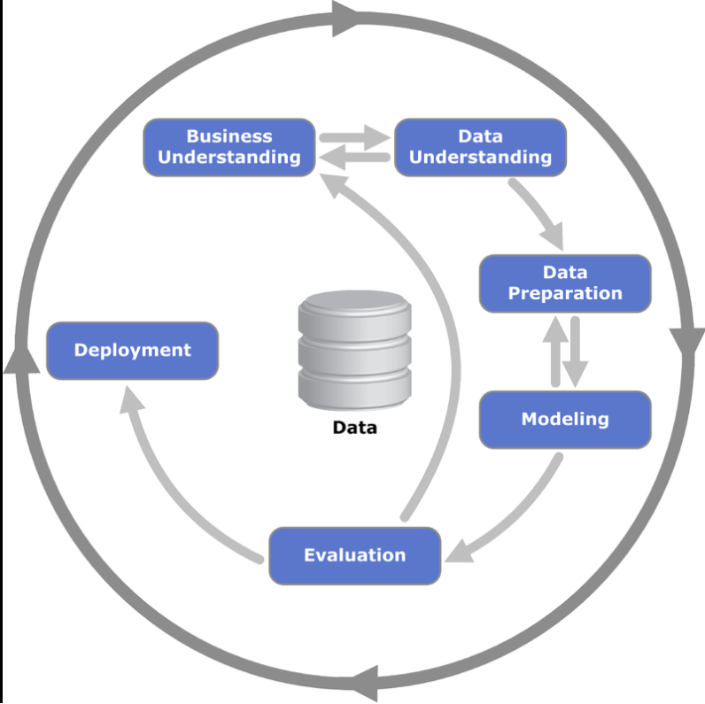
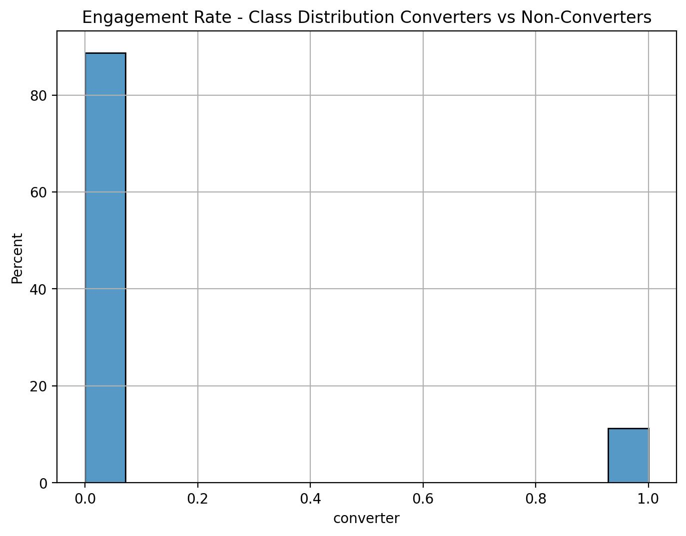
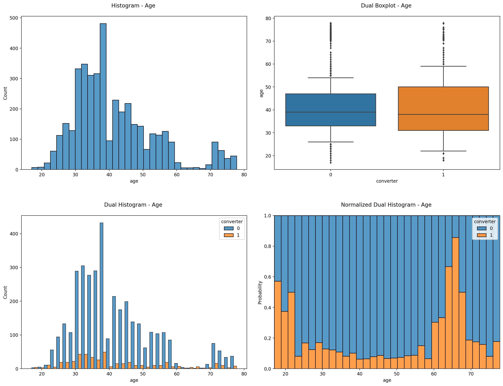
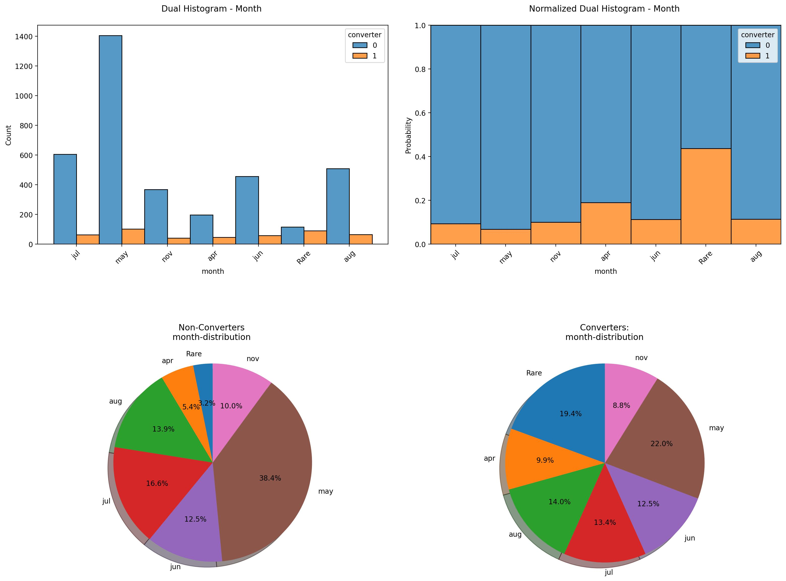
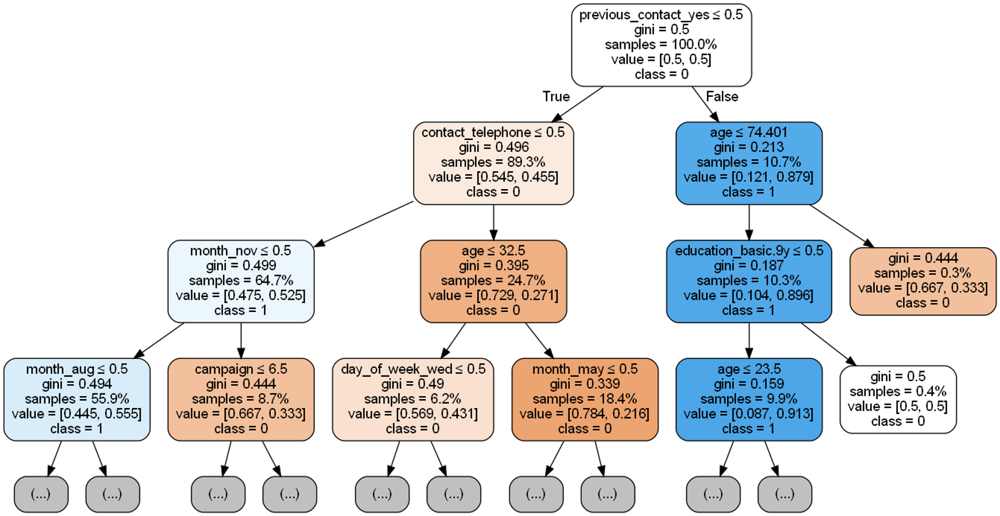

# Marketing Engagement Prediction Model to Maximize ROI: Implementation of an End-to-End Machine Learning Solution 

## **Motivation:**  
Marketing conversion prediction adds tremendous value to any marketing campaign. By leveraging data and predictive analytics, marketers are able to anticipate and measure the likelihood of a customer or user completing a desired action. This gives marketers the opportunity to strategically target the most valuable customers and maximize their ROI. 

## **Data Source:**  
This demo project is based on the publicly available dataset from the UCI machine learning repository: 
https://archive.ics.uci.edu/ml/datasets/bank+marketing

## **Project Goal:**  
The goal of this project is to  
1. identify engagement drivers, 
2. evaluate engagement prediction model,
3. implement web app using streamlit
3. transform web app into highly efficient software using Docker
4. deployed model in streamlit cloud: [streamlit cloud](https://sebastian1981-marketing-sales-conversion-pre-web-appmain-y81hcx.streamlit.app/)
 
## **Solution Approach:**  
The project is developed according to the well-known CRISP-DM
[CRISP-DM Model](https://en.wikipedia.org/wiki/Cross-industry_standard_process_for_data_mining).

- "Business Understanding", "Data Understanding", "Data Preparation", "Modeling" & "Evaluation": see Jupyter Notebook "/experiment/01_bank_customer_conversion_prediction_poc.ipynb". 
- "Deployment": see Jupyter Notebook "/experiment/02_bank_customer_conversion_prediction_scoring_pipeline.ipynb" and "/web_app". 

## **Tools:**  
vscode, python, jupyter, pandas, numpy, sklearn, shap, docker, streamlit

## **Solution Steps:**
1. undestanding and exploring the historical dataset of marketing campaigns using different data visualisation techniques using jupyter notebook
2. preparing the data for statistical modeling using jupyter notebook
3. training and tuning the best machine learning model using jupyter notebook
4. extract the diving features of marketing conversion exploiting novel methods of explainable artificial intelligence using jupyter notebook
5. implementing a web app to predict individual conversion probabilities using streamlit 
6. deployment of the web app using docker and streamlit cloud 

## **Key Findings:**
### **Average Engagement Rate:**

The average engagement rate among all customers is 12%.

### **Key Drivers to Marketing Engagement:**

Apparently there is a clear age effect on the engagement rate. The age groups around 20 years and between 60-70 years are more likely to engage than the mid-agers.

There is a clear seasonal effect on engagement rate. E.g. in the non-converters group, the largest proportion of customers is found in the month of May whereas in the converters group the proportion of customers in May is clearly smaller. Therefore, the month of May seems to have an unfavorable effect on the success of a marketing campaign.

The simple decision tree analysis shows that features "p_outcome", "contact" and "age" are among the key engagement drivers. The "p_outcome" variable represents whether the last marketing campaign was successful with a particular customer or not. The "contact" and "age" variables represent the type of contact and the customer ́s age, respectively. If we take a closer look at the decision tree, we can see, for example, that the conversion rate is 91% if the last marketing campaign was successful (“p_outcome_successfull”) and the customer is in the younger age group (“age<17.5”). In comparison, the global conversion rate is only 12%. Hence, focusing on this young-age group would already lift the conversion rate by a factor of more than 7. The decision tree analysis remarkably shows the value this data-based analysis can add for optimizing marketing campaigns. However, we would like a more comprehensive insight into the key drivers and their effect on engagement rates. Therefore, we applied a state-of-the-art explainable artificial intelligence approach to gain complete insight to what drives marketing success.